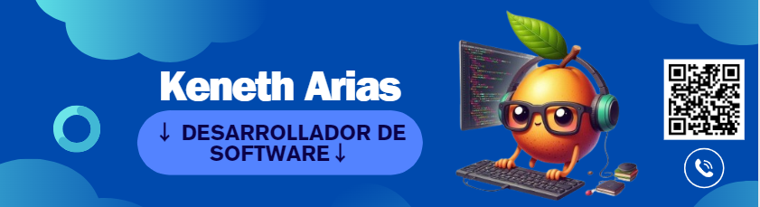

### Hi there 👋

<h1 align="center">Hola, soy <a href="imagen.png">Keneth Arias</a> </h1>

LUYouTube_Channel_Subseribersl(https://ing.shields.io/youtube/channel/subscribers/UCIjEgHA1vatSR2K4rfcdNRg?style=social)]
(https://youtube.com/aristidevs?sub_confirmation=1)
LlTwitch_Status](https://img.shields.io/twitch/status/aristidevs?style=social)](https://www.twitch.tv/aristidevs)
L!GifHub_followersl(https://img.stpelds.io/github/followers/arisguimera?style=social)](https://github.com/ArisGuimera)
! [Discord_Shield](https://discordapp.com/api/guilds/807719549075980308/widget.png?style=shield)
<!--
**thekeneth0212/thekeneth0212** is a ✨ _special_ ✨ repository because its `README.md` (this file) appears on your GitHub profile.

Here are some ideas to get you started:

- 🔭 I’m currently working on ...
- 🌱 I’m currently learning ...
- 👯 I’m looking to collaborate on ...
- 🤔 I’m looking for help with ...
- 💬 Ask me about ...
- 📫 How to reach me: ...
- 😄 Pronouns: ...
- ⚡ Fun fact: ...
-->
